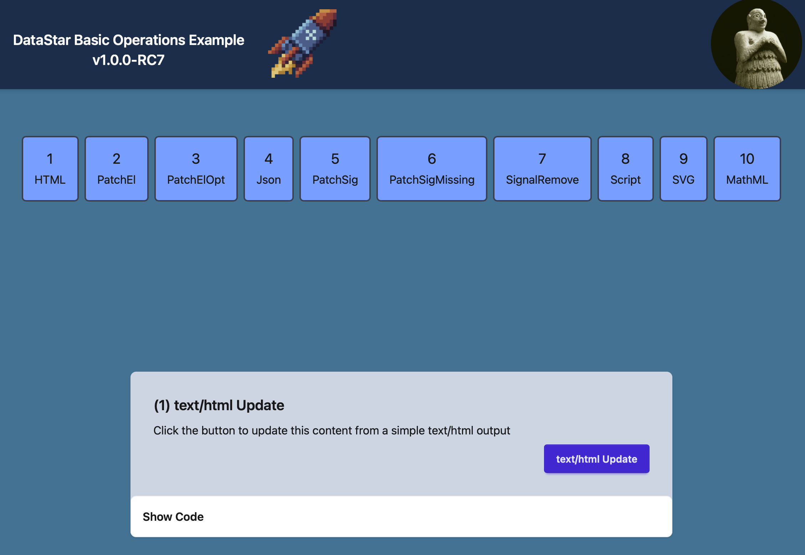
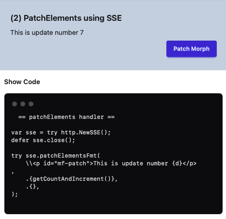
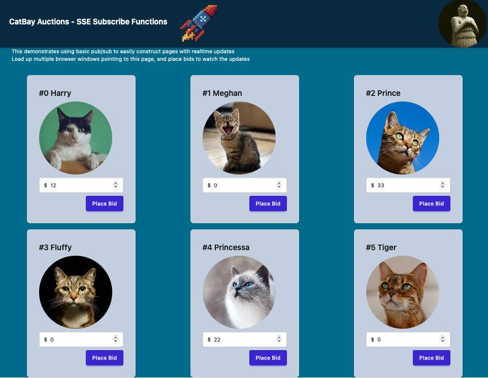
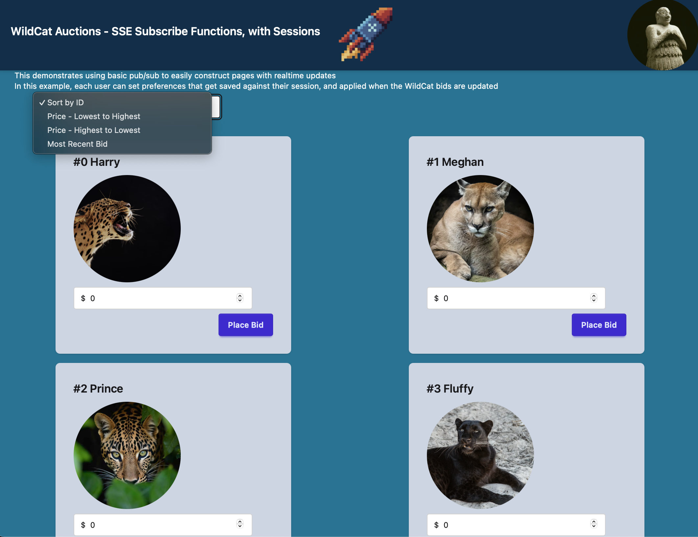
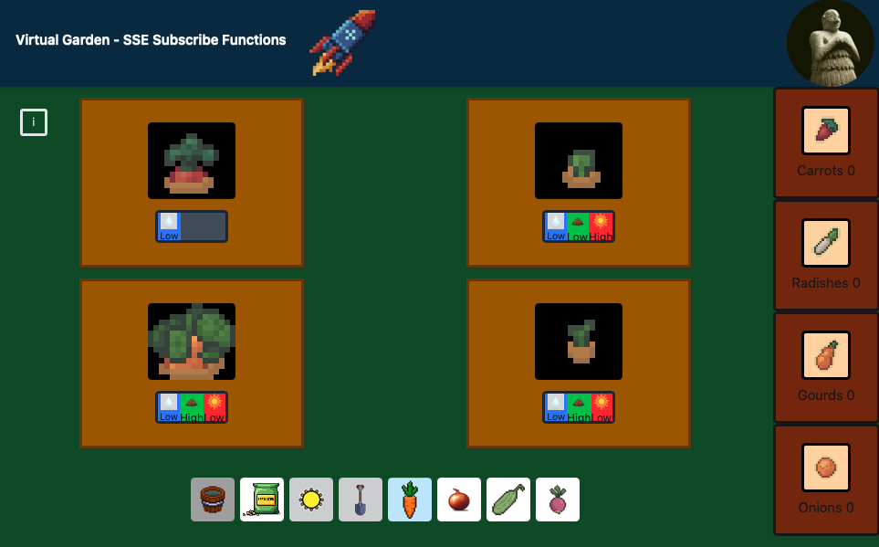

# Datastar lib for zig 0.16-dev


A Zig library for 0.16 / latest stdlib that conforms to the Datastar SDK specification.

https://github.com/starfederation/datastar/blob/develop/sdk/ADR.md

.. and passes the official Datastar test cases.

Versions :

- Datastar 1.0.1
- Zig 0.16.0

## Changelog

| Date            | Build Version               | Major Changes / Features Included                                                                   |
| :-------------- | :-------------------------- | :-------------------------------------------------------------------------------------------------- |
| **10-Jan-2026** | `0.16.0-dev.2040+c475f1fcd` | **Juicy Main** changes (Entry point & std refactor)                                                 |
| **19-Jan-2026** | `0.16.0-dev.2193+fc517bd01` | `http.content()`, `http.css()`, `http.sendFile()`                                                   |
| **20-Jan-2026** | `0.16.0-dev.2193+fc517bd01` | `Breaking Changes` - Removed ServerCtx - use type erased ctx in http request                        |
| **08-Feb-2026** | `0.16.0-dev.2510`           | Still trying to get fibers sort of half reliable. They dont crash, but they dont always work either |
| **04-Mar-2026** | `0.16.0-dev.2682`           |                                                                                                     |
| **15-Mar-2026** | `0.16.0-dev.2821`           | ArrayListUnmanaged now deprecated                                                                   |
| **13-May-2026** | `0.16.0`                    | Refactored `ScriptAttributes` to use internally `std.array_hash_map.String`.                        |

For stable Zig 0.15.2 - see https://github.com/zigster64/datastar.http.zig

# DOCUMENTATION AND DEV VERSION WARNING

This current README is pretty big - and is very much a work in progress till 0.16 stabilises, and until I have time
to write up a proper doc / tutorial.

I have pushed the dev branch onto master now, because Zig stdlib is changing too fast, such that master
doesnt even compile anymore with the latest zig.

So the code is up to date, but this README is not. It will contain some misinformation until its updated, which could take a bit longer, sorry.

If in doubt - DO NOT COPYPASTE CODE FROM THIS README and expect it all of it to work without some editting ... check the examples and the repo code instead.

Also, this is working with Zig 0.16-2682 .. there is no guarantee that extra releases of Zig 0.16 wont suddenly break this code.

Also, on Linux/x86- if `zig build` fails with strange errors, then revert to using `zig build -Doptimize=ReleaseSafe` .. the current x86 backend
may be flakey with this code, YMMV.

If you want to be using Postgres in your backends with Zig 0.16 - I have a branch here that works with `pg.zig`, although the changes needed
to get it running under 0.16 are starting to get ugly indeed.

https://github.com/zigster64/pg.zig

Enjoy the ride on the bleeding edge !

# Audience and Scope

Who is this repo for ?

- Anyone interested in using Datastar. https://data-star.dev.

Datastar allows you to build interactive Web UIs, driven from the backend server, using only
declarative HTML on the frontend, and streaming events from the backend.

It is particularly good for doing real time push updates, event sourcing, and
multi-player or collaborative applications.

See the end of this document for more resources if you want to know more about Datastar in detail.

Datastar uses a well defined SSE-first protocol that is backend agnostic - you can use the the same simple
SDK functions to write the same app in Go, Clojure, C#, PHP, Python, Bun, Ruby, Rust, Lisp, Racket, Java, etc.

This project adds Zig 0.16-dev to that list of supported SDK languages.

_Why consider the Zig version then ? Who is that for ?_

- Existing Zig programmers who want to try working with Web+Datastar under 0.16-dev
- Datastar app builders who want to experiment with performance, and dabble in new backend languages

Consider Zig if every microsecond counts, or you want small memory footprints.

Try it out.

# Installation and Usage

To build an application using this SDK

1. Add datastar.zig as a dependency in your `build.zig.zon`:

```bash
zig fetch --save="datastar" "git+https://github.com/zigster64/datastar.zig"
```

2. In your `build.zig`, add the `datastar` module as a dependency of your program:

```zig
const datastar = b.dependency("datastar", .{
    .target = target,
    .optimize = optimize,
});

// the executable from your call to b.addExecutable(...)
exe.root_module.addImport("datastar", datastar.module("datastar"));

// or add the module "datastar" to the .imports section of your exe
```

3. In your application code

Depends on the HTTP Framework you are using.

This SDK does include a complete HTTP Framework for Zig 0.16 to get
you started. Here is a full example using this built in HTTP Server
with Datastar specific SSE events.

```zig

const std = @import("std");
const datastar = @import("datastar");
const HTTPServer = datastar.HTTPServer;
const HTTPRequest = datastar.HTTPRequest;

const PORT = 8080;

pub fn main(process_init: std.process.Init) !void {
    const allocator = process_init.gpa;
    const io = process_init.io;

    var server = try HTTPServer.init(process_init); // port defaults to 8080
    defer server.deinit();
    std.debug.print("Server listening on http://{s}:{}\n", .{"localhost", PORT});

    // Setup all the routes
    const r = server.router;
    r.get("/", index);
    r.get("/sse/:id", sseEndpoint);
    ... all the routes

    try server.run();
}

// Index page handler code
fn index(http: *HTTPRequest) !void {
    // Note
    // - Include the Datastar bundle (or you can host your own)
    // - The body makes a call to /see to fetch content
    // - The div id="hello" is a target for updating in the /sse call
    // - The data-json-signals element provides debugging output for the current state of signals
    return http.html(
        \\<!DOCTYPE html>
        \\<head>
        \\  <script type="module"
        \\    src="https://cdn.jsdelivr.net/gh/starfederation/datastar@1.0.1/bundles/datastar.js">
        \\  </script>
        \\</head>

        \\<body data-init="@get('/sse/zig')">
        \\  <div id="hello">Loading ...</div>
        \\  <div>Foo <span data-text="$foo"></span></div>
        \\  <div>Bar <input data-bind:bar /></div>
        \\  <pre data-json-signals></pre>
        \\</body>
    );
}

// A simple SSE endpoint that generates a set of events over the stream
fn sseEndpoint(http: *HTTPRequest) !void {
    const id = http.params.get("id") orelse return error.NoID;

    // turn the endpoint into an SSE stream
    var sse = try http.NewSSE();
    defer sse.close();

    // Now we can send multiple actions over the SSE stream

    // Update just the id='hello' element in the DOM
    try sse.patchElements("<div id='hello'>Hello World</div>", .{});

    // send a batch of signals for reactive DOM updates
    try sse.patchSignals(.{ .foo = 42, .bar = "Datastar Rocks" }, .{}, .{});

    // invoke scripts directly from the backend
    try sse.executeScriptFmt("alert('All your base are belong to {s}')", .{id}, .{});
}
```

# Web Server that works with Zig 0.16-dev ?

This 0.16 Version of the Datastar SDK includes a basic web development framework and fast radix-tree
based router that uses the stdlib http server.

It uses similar API conventions to https://github.com/karlseguin/http.zig, tuned
specifically for use with Datastar applications.

You can use this built-in server, or you can use any other HTTP Server Framework that works with
Zig 0.16.

See the example above in the install step about using the built in HTTP Server.

See notes at the end of this document about adapting other HTTP Server Frameworks.

# Quick Start Introduction

If you just want to quickly install this, and try out the demo programs first, do this :

```
... get zig 0.16-dev installed on your machine, then ...

git clone https://github.com/zigster64/datastar.zig
cd datastar.zig
zig build
./zig-out/bin/example_1
```

Then open your browser to http://localhost:8081

This will bring up a kitchen sink app that shows each of the SDK functions in use in the browser, with a
section that displays the code to use on your backend to drive the page you are looking at.

Suggest that you use the Browser DevTools to have a look at whats happening over the wire in each case.

For the SSE streams, you can see that the request contains a stream of small payloads that contain
an event header, some params, followed by multiple lines of data.





---

Example of SVG and MathML morphing from the backend

The SDK allows you to patch interior elements of an SVG or MathML block, without having to re-render the
entire block.

https://github.com/user-attachments/assets/e8f48b44-c84d-4c43-9c1c-58a057db3e33

https://github.com/user-attachments/assets/2383156f-6ba1-40de-8b45-117bbf59ed84

---

`./zig-out/bin/example_2` - a simple cat auction site.
Bring up multiple browser windows and watch the bids get updated in realtime to all windows.



---

`./zig-out/bin/example_3` - a more complex WildCat aution site, with session based preferences managed
at the backend.

Bring up multiple browser windows and watch the bids get updated in realtime to all windows.
Change preferences, and watch that all browser windows in the same session get their preferences updated.

Use a different machine, or browser to simulate a new session.

Note that the bids update in realtime across all clients, and just the preferences changes are sticky
across all clients belonging to the same session.

When the backend generates an update for each connected client, the output is customized by the backend
to suit the session preferences.

There is no logic being applied on the frontend in this example - its all driven from the backend.



---

`./zig-out/bin/example_5` - an excellent and exciting multi-player farming simulator, where users can plant and attend
to various crops to help them grow to harvest (or whither and die if neglected)



# Validation Test

When you run `zig build`, it will compile several apps into `./zig-out/bin` including a binary called `validation-test`

Run `./zig-out/bin/validation-test`, which will start a server on port 7331

Then follow the procedure documented at

https://github.com/starfederation/datastar/blob/main/sdk/tests/README.md

To run the official Datastar validation suite against this test harness

The source code for the `validation-test` program is in the file `tests/validation.zig`

Current version passes all tests.

# Functions

## Cheatsheet of all Datastar SDK functions

```zig
const datastar = @import("datastar");
const HTTPServer = datastar.HTTPServer;
const HTTPRequest = datastar.HTTPRequest;

// read signals either from GET or POST
http.readSignals(comptime T: type) !T  // for use with the built in HTTPServer, where http = *HTTPRequest
datastar.readSignals(comptime T: type, arena: std.mem.Allocator, req: *std.http.Server.Request) !T // generic interface if you are not using the built in HTTPServer

// set the connection to SSE, and return an SSE object
var sse = http.NewSSE() !SSE
var sse = http.NewSSESync() !SSE
var sse = http.NewSSEOpt(sse_options) !SSE

// when you are finished with this connection - you will want to do ONE of these
defer sse.close()
defer sse.flush()

// when you want to keep the connection alive for a long time
// then you might want to send keepalive pings every minute or
// so to ensure that the connection is tracked.
// Call this to send a "keepalive" SSE event
sse.keepalive()

// patch elements function variants
sse.patchElements(elementsHTML, elements_options) !void
sse.patchElementsFmt(comptime elementsHTML, arguments, elements_options) !void
sse.patchElementsWriter(elements_options) *std.Io.Writer

// patch signals function variants
sse.patchSignals(value, json_options, signals_options) !void
sse.patchSignalsWriter(signals_options) *std.Io.Writer

// execute scripts function variants
sse.executeScript(script, script_options) !void
sse.executeScriptFmt(comptime script, arguments, script_options) !void
sse.executeScriptWriter(script_options) *std.Io.Writer
```

## Cheatsheet of all HTTPServer functions

```zig
// Config struct for HTTPServer
pub const Config = struct {
    address: ?[]const u8 = null, // if null, will listen on all addresses
    port: u16, // must be provided
    log: Log = .{},
    io: ?Io = null,
    allocator: ?Allocator = null,
    watch: bool = false, // set to true to reboot on the executable file changing
    fd_limit: ?FDLimit = null, // set to a value to override system FD limit for this process
};

// FD limit configuration
// leave config as null to ignore, set to .limited(N) to set, or .max to set to MAX
pub const FDLimit = enum(u64) {
    max = std.math.maxInt(u64),
    _,

    pub fn limited(n: u64) FDLimit {
        return @enumFromInt(n);
    }
};

// Create a new server
server.init(process_init, config) !*HTTPServer

// Assign a global context to pass to all requests
server.useCtx(T: type) T

// eg - if you have a struct 'app' of type App that holds your global state
// server.useCtx(&app)  will store this reference and add it to all requests


// Server Log Config - see the section on logging
// You can configure a number of params such as the level of logging
// the type of logging (json / zon / text mode)
// color theme for logging
// additional info such as session data, etc

// cleanup the server
server.deinit()

// run the server
server.run()

// spawn a concurrent task grouped with the server
server.concurrent(fn_ptr, args)
```

The built in HTTPServer provides a simple fast router

```zig
var r = server.router;  // get the router from the Server we created

r.get(path, handler)
r.post(path, handler)
r.patch(path, handler)
r.delete(path, handler)

// Generic route
r.add(method, path, handler)

// Path Parameters example
r.get("/users/:id/:action", userHandler)

fn userHandler(*HTTPRequest) !void {
    const id = http.params.get("id");
    const action = http.params.get("action");
    ...
}

```

When using the built in HTTPServer, all handlers receive a single param
of type `*HTTPRequest`

If you want a global Context to be available inside handlers, set this value
on the Server instance using `server.useCtx(*MyGlobalData)`, then inside
the handler, extract it using `const my_data = http.getCtx(TYPE)`

This HTTPRequest has the following features :

```zig
// Internal values

http.req     - the *std.http.Server.Request value
http.io      - which std.Io interface is in use when calling this handler
http.arena   - a per-request arena for doing allocations in your handler
http.params  - the route parameters used in the request
http.path    - the full URL path including query params
http.method  - the HTTP method

// Get just the URL path without Query params
http.getPathOnly() []const u8

// Sending content in the response
http.data(content, mime_type) !void // output content with given mime type
http.html(content) !void            // output content as text/html
http.htmlFmt(format, args) !void    // print formatted output content as text/html
http.json(content) !void            // convert content to JSON and output as application/json
http.css(content) !void             // output content as text/css
http.cssFmt(format, args) !void     // print formatted output content as text/css
http.js(content) !void              // output content as application/javascript
http.jsFmt(format, args) !void      // print formatted output content as application/javascript

// Sending a file
// Set optional mime_type to null to calculate the mime_type based on the filename extension
http.sendFile(filename, ?mime_type) !void

// Dealing with query params
http.query() ?[]const u8            // get the query string for this request or null if not present
http.readSignals(T) !T              // read the signals from the request into struct of given type
http.setCookie(name, value)         // set a cookie with the response
http.getCookie(name)                // get a cookie from the requesnt

// Route Parameters
http.params.get(name) ?[]const u8  // get the value of named parameter :name
http.params.getInt(T, name) ?T     // get the value of named parameter :name as an Integer
```

The built in functions allow you to easily return text/html or application/json. (as well as Datastar SSE actions, as shown below)

If you want to do anything more exotic, just use the `http.req` to construct whatever other response type you might need ... the new 0.16 stdlib
provides a lot of very low level control options for returning responses there.

## Configure Server Limits

When creating a HTTPServer, you pass in a Config struct to configure the behaviour.

You can set these additional values :

For setting the Process File Descriptor limit

- .fd_limit = null // ignore - use the system default
- .fd_limit = .limited(u64) // set to the specified value
- .fd_limit = .max // set to the maximum allowed by the system (unlimited)

## Configuring Thread Pools

Handling thread pools can be interesting.

For a typical Datastar application with lots of persistent SSE connections, which each
consume a Thread / Coroutine ... if you are not careful, you can hit the maximum number
of supported concurrency units, at which point the whole system will stop accepting new
connections.

To prevent this, the built in HTTPServer uses a set of distinct Thread Pools to manage concurrency.

In the Server Config, there are 3 variables you can set :

- .threads = u64 // set up a pool of threads to manage all short lived connections
  // defaults to Num CPUs
- .stack_size // stack size for the main thread pool
- .sse_threads = u64 // set up a pool of threads to manage long lived SSE connections
  // when this is full, extra persistent SSE's will be blocked,
  // but the system will continue to operate.
  // You can define a Middleware hook to catch the "SSE Full" condition
  // and provide the end user with an action
- .public_sse_threads = u64 // A separate pool of public SSE connections with its own limit
- .sse_stack_size // stack size for all persistent SSE connections

The reason for having 2 SSE pools is for the situation where you have - say - "premium tier" users
and "free tier" users.

You want to guarantee service for the premium tier users by having a large enough thread pool,
and limit the free tier users ... so you dont have a situation where too many free tier users
exhaust the server for your paid members.

Use good judgment and experimentation to adjust these variables to account for memory usage,
performance, actual stack usage, etc.

# Using the Datastar SDK

## The SSE Object

Calling NewSSE on the HTTPRequest will return an object of type SSE.

```zig
    sse.NewSSE() !SSE
```

This will configure the connnection for SSE transfers, and provides an object with Datastar methods for
patching elements, patching signals, executing scripts, etc.

When you are finished with this SSE object, you must call `sse.close()` to finish the handler.

When running in this default mode (named internally as 'batched mode'), all of the SSE patches are batched
up, and then passed up to the HTTP library for transmission, and closing the connection.

In batched mode, the entire payload is sent as a single transmission with a fixed content-length header,
and no chunked encoding.

You can declare your sse object early in the handler, and then set headers / cookies etc at any time
in the handler. Because actual network updates are batched till the end, everything goes out in the correct order.

```zig
    sse.NewSSESync() !SSE
```

Will create an SSE object that will do immediate Synchronous Writes to the browser as each `patchElements()` call is made.

Finally, there is a NewSSE variant that takes a set of options, for special cases

```zig
    sse.NewSSEOpt(SSEOptions) !SSE

    // Where options are
    const SSEOptions = struct {
        buffer_size: usize = 16 * 1024, // internal buffer size for batched mode
        sync: bool = false,
        extra_headers: ?[]const std.http.Header = null,
    };
```

## Reading Signals from the request

Using the built in HTTPServer

```zig
    pub fn http.readSignals(comptime T: type) !T
```

Using a generic version for other HTTP Frameworks

```zig
    pub fn datastar.readSignals(comptime T: type, arena: std.mem.Allocator, req: *std.http.Server.Request) !T
```

Will take a Type (struct) and a HTTP request, and returns a filled in struct of the requested type.

If the request is a `HTTP GET` request, it will extract the signals from the query params. You will see that
your GET requests have a `?datastar=...` query param in most cases. This is how Datastar passes signals to
your backend via a GET request.

If the request is a `HTTP POST` or other request that uses a payload body, this function will use the
payload body to extract the signals. This is how Datastar passes signals to your backend when using POST, etc.

Either way, provide `readSignals` with a type that you want to read the signals into, and it will use the
request method to work out which way to fill in the struct.

Example :

```zig
    const FooBar = struct {
        foor: []const u8,
        bar: []const u8,
    };

    const signals = try http.readSignals(FooBar);
    std.debug.print("Request sent foo: {s}, bar: {s}\n", .{signals.foo, signals.bar});
```

If you prefer, you can use anonymous structs too - can make the code more readable :

```zig
    const signals = try http.readSignals(struct {foo: []const u8, bar: []const u8});
    std.debug.print("Request sent foo: {s}, bar: {s}\n", .{signals.foo, signals.bar});
```

## Patching Elements

The SDK Provides 3 functions to patch elements over SSE.

These are all member functions of the SSE type that NewSSE(http) returns.

```zig
    pub fn patchElements(self: *SSE, elements: []const u8, opt: PatchElementsOptions) !void

    pub fn patchElementsFmt(self: *SSE, comptime elements: []const u8, args: anytype, opt: PatchElementsOptions) !void

    pub fn patchElementsWriter(self: *SSE, opt: PatchElementsOptions) *std.Io.Writer
```

Use `sse.patchElements` to directly patch the DOM with the given "elements" string.

Use `sse.patchElementsFmt` to directly patch the DOM with a formatted print (where elements,args is the format string + args).

Use `sse.patchElementsWriter` to return a std.Io.Writer object that you can programmatically write to using complex logic.

When using the writer, you can call `w.flush()` to manually flush the writer ... but you generally
dont need to worry about this, as the sse object will correctly terminate an existing writer, as
soon as the next `patchElements / patchSignals` is issued, or at the end of the handler cleanup
as the `defer sse.close() / defer sse.deinit()` functions are called.

See the example apps for best working examples.

PatchElementsOptions is defined as :

```zig
pub const PatchElementsOptions = struct {
    mode: PatchMode = .outer,
    selector: ?[]const u8 = null,
    view_transition: bool = false,
    event_id: ?[]const u8 = null,
    retry_duration: ?i64 = null,
    namespace: NameSpace = .html,
};

pub const PatchMode = enum {
    inner,
    outer,
    replace,
    prepend,
    append,
    before,
    after,
    remove,
};

pub const NameSpace = enum {
    html,
    svg,
    mathml,
};
```

See the Datastar documentation for the usage of these options when using patchElements.

https://data-star.dev/reference/sse_events

Most of the time, you will want to simply pass an empty tuple `.{}` as the options parameter.

Example handler (from `examples/01_basic.zig`)

```zig
fn patchElements(req: *httpz.Request, res: *httpz.Response) !void {
    var sse = try datastar.NewSSE(http);
    defer sse.close();

    try sse.patchElementsFmt(
        \\<p id="mf-patch">This is update number {d}</p>
    ,
        .{getCountAndIncrement()},
        .{},
    );
}
```

## Patching Signals

The SDK provides 2 functions to patch signals over SSE.

These are all member functions of the SSE type that NewSSE(http) returns.

```zig
    pub fn patchSignals(self: *SSE, value: anytype, json_opt: std.json.Stringify.Options, opt: PatchSignalsOptions) !void

    pub fn patchSignalsWriter(self: *SSE, opt: PatchSignalsOptions) *std.Io.Writer
```

PatchSignalsOptions is defined as :

```zig
pub const PatchSignalsOptions = struct {
    only_if_missing: bool = false,
    event_id: ?[]const u8 = null,
    retry_duration: ?i64 = null,
};
```

Use `patchSignals` to directly patch the signals, passing in a value that will be JSON stringified into signals.

Use `patchSignalsWriter` to return a std.Io.Writer object that you can programmatically write raw JSON to.

Example handler (from `examples/01_basic.zig`)

```zig
fn patchSignals(req: *httpz.Request, res: *httpz.Response) !void {
    var sse = try datastar.NewSSE(http);
    defer sse.close();

    const foo = prng.random().intRangeAtMost(u8, 0, 255);
    const bar = prng.random().intRangeAtMost(u8, 0, 255);

    try sse.patchSignals(.{
        .foo = foo,
        .bar = bar,
    }, .{}, .{});
}
```

## Executing Scripts

The SDK provides 3 functions to initiate executing scripts over SSE.

```zig

    pub fn executeScript(self: *SSE, script: []const u8, opt: ExecuteScriptOptions) !void

    pub fn executeScriptFmt(self: *SSE, comptime script: []const u8, args: anytype, opt: ExecuteScriptOptions) !void

    pub fn executeScriptWriter(self: *SSE, opt: ExecuteScriptOptions) *std.Io.Writer
```

ExecuteScriptOptions is defined as :

```zig
pub const ExecuteScriptOptions = struct {
    auto_remove: bool = true, // by default remove the script after use, otherwise explicity set this to false if you want to keep the script loaded
    attributes: ?ScriptAttributes = null,
    event_id: ?[]const u8 = null,
    retry_duration: ?i64 = null,
};
```

Use `executeScript` to send the given script to the frontend for execution.

Use `executeScriptFmt` to use a formatted print to create the script, and send it to the frontend for execution.
Where (script, args) is the same as print(format, args).

Use `executeScriptWriter` to return a std.Io.Writer object that you can programmatically write the script to, for
more complex cases.

Example handler (from `examples/01_basic.zig`)

```zig
fn executeScript(req: *httpz.Request, res: *httpz.Response) !void {
    const value = req.param("value"); // can be null

    var sse = try datastar.NewSSE(http);
    defer sse.close();

    try sse.executeScriptFmt("console.log('You asked me to print {s}')"", .{
            value orelse "nothing at all",
    });
}
```

# Adding Response Headers

There are a couple of ways you can send additional headers with your responses.

See this example in `examples/01_basic.zig`

```zig
fn patchElements(http: *HTTPRequest) !void {
    var t1 = try std.time.Timer.start();
    defer std.debug.print("patchElements elapsed {}(μs)\n", .{t1.read() / std.time.ns_per_ms});

    // Apply extra headers to the HTTPRequest before the response is sent
    http.extra_headers = &.{
        .{ .name = "X-More-Headers", .value = "Top level http extra headers" },
        .{ .name = "X-Even-More-Headers", .value = "Top level http more headers" },
    };

    // Append additional headers to a HTTPRequest before the response is sent
    http.extra_headers = try http.mergeHeaders(&.{
        .{ .name = "X-Appended-Headers", .value = "These were appended to the top level" },
        .{ .name = "X-Even-More-Appended-eaders", .value = "More appended to the top level" },
    });

    // Define extra headers here when creating the SSE response
    var sse = try http.NewSSEOpt(.{ .extra_headers = &.{
        .{ .name = "X-SSE-More-Headers", .value = "Patch Elements Example" },
        .{ .name = "X-SSE-Even-More-Headers", .value = "All the Headers" },
    } });
    defer sse.close();

    try sse.patchElementsFmt(
        \\<p id="mf-patch">This is update number {d}</p>
    ,
        .{getCountAndIncrement()},
        .{},
    );

    // All 6 of the above headers will be sent with the patchElements response
}

```

# Automatic Response if missing

Its quite common when you are writing a POST/PUT/PATCH/DELETE handler, that you
just want to update some internal state in your app, and leave it at that.

Its easy to forget to send a response !

Without a response, the browser will think that you are going to be streaming data
down this connection, and keep the request alive indefinitely. You wont even see
any side effects of this unless you carefully view your network activity in dev tools.

Thats probably not what you intended !

To prevent this, the built in Server / Router will automatically terminate the request
with a response of type `status: 200, content ""`

If -

# Advanced SSE Topics

## Batched Writes vs Synchronous Writes

By default, when you create a `NewSSE(http)`, and do various actions on it such as `patchElements()`, this
will buffer up the converted SSE stream, which is then written to the client browser as the request is
finalised.

In some cases you may want to do Synchronous Writes to the client browser as each operation is performed in the
handler, so that as each `patchElements()` call is made, the patch is written immediately to the browser.

In this case use `NewSSESync(http)` to set the SSE into Synchronous Mode.

For example - in the SVGMorph demo, we want to generate a randomized SVG update, then write that to the client
browser, then pause for 100ms and repeat, to provide a smooth animation of the SVG.


## Namespaces - SVG and MathML (Datastar RC7+ feature)

`patchElements()` works great when morphing small fragments into existing DOM content, using the element ID,
or other selectors.

Unfortunately, when we have a large chunk of SVG or MathML content, the standard HTML morphing
cannot reach down inside the SVG markup to pick out individual child elements for individual updates.

However, you can now use the `.namespace = svg` or `.namespace = mathml` options for `patchElements()` now
to do exactly this.

See the SVG and MathML demo code in example_1 to see this in action.

# Publish and Subscribe

Publish and Subscribe is at the heart of reactive Multi-Player apps. We want to exploit the SSE streams to push updates to clients from
the backend, and we need a message bus of sorts to track all the connected clients and what topics they are listening on.

The older `datastar.http.zig` SDK for use with Zig 0.15.2 (here - https://github.com/zigster64/datastar.http.zig) has a built in pub/sub
system that exploits the fact that http.zig allows you to detach sockets from handlers for later use.

In Zig 0.16 - The recommended approach here will be to use the Evented IO to create long running coroutines
for those handlers that want to subscribe to topics. For now, we are using Io.Threaded in the examples until Io.Evented
is fully baked. Io.Threaded isnt a huge overhead, since each thread is put to sleep whilst its waiting for the next message, so its
just the memory overhead. Zig allows you to easily tune the stack size used for threads down to some maximum to keep that nicely under control.

For publishing to topics in a production environment, then just connect in a message bus such as Redis, or NATS, or Postgres listen/notify and thats all thats needed.

The example apps in this SDK that require PubSub, use this embedded message broker https://github.com/zigster64/pubsub.zig .. which was custom built specifically for these Datastar SSE runners.

You dont _have to_ use this message broker, but its bundled into this SDK for convenience to get you started.

Swap in your own PubSub / Mailbox / Message Queue engine as you need, and follow the same basic logic

- Create an SSE response in sync mode, with `NewSSESync()`
- `defer sse.close()` to close the connection when complete
- Send the first payload now, before the loop
- In the handler, connect to whatever message broker you are using
- Subscribe to various topics
- Loop forever getting messages
    - perform some action on the message

You can see this being used in `02_cats.zig` for example, to update bids on the cat auctions.

```zig
// Optional embedded PubSub broker is bundled in the SDK for easy access
const pubsub = datastar.pubsub;

// SSE persistent handler that subscribes to the message broker
fn catsList(app: *App, http: *HTTPRequest) !void {
    var sse = try http.NewSSESync();
    defer sse.close();
    try pushCatList(app, &sse);

    var mq = try app.pubsub.connect(); // <-- the broker is referenced here
    defer mq.deinit();

    // Subscribe to the message broker
    try mq.subscribe(.cats);

    // loop forever over the events
    while (try mq.nextTimeout(.fromSeconds(30))) |event| {
        switch (event) {
            .msg => try pushCatList(app, &sse),
            .timeout => try sse.keepalive(),
        }
    }
}

// elsewhere, when a new bid has been posted
fn postBid(app: *App, http: *HTTPRequest) !void {
    ... do stuff ... then ..

    try app.pubsub.publish(.{ .cats = {} }, .all);
}

```

# Local Development Utilities

The Zig Datastar SDK provides some built in tools to make local development and testing more pleasant.

For hot reloads of the browser, there are a couple of idiomatic ways of dealing with this.

If your application uses any persistent SSE connections to regularly update state, then ideally you should
write these so that they output enough information to completely update the client content and state.

That could mean sending the complete page (aka a "Fat Morph"), and letting the morph engine on the browser
sort out which DOM elements need updating.

When the backend server stops and starts, the persistent SSE is closed, which triggers Datastar in the browser
to try to re-establish that connection. When it re-establishes, it will send enough updated content and signals to
correctly re-render the browser.

Sometimes that is not practical, or sometimes your app has no persistent SSE connection that can do this.

If you have a look in `01_basic.zig` - the code for example_1 ... we dont have any persistent SSE connection
to do this, so this app adds an endpoint `/hotreload/:id`

When the app is started, it will store the current timestamp as the unique "Deployment ID", which is
then hard coded into `data-init="@post('/hotreload/DEPLOYMENT_ID')"` in `01_index.html`.

This `POST /hotreload/:id` endpoint is a long lived SSE connection.

So when the server stops and starts (due to a re-deployment) the browser will automatically try to
reconnect the dropped SSE connection, but pass the old DEPLOYMENT_ID.

The server detects this, and sends a `window.location.reload()` to the browser.

- Restart Server on Re-Compile \*

To compliment the browser hotreload, the Zig Datastar SDK provides a utility function you can add
to your server code, to automatically reload the server executable whenever it is recompiled.

You can achieve this by adding a call to `server.rebooter(process_init)` during startup :

```zig
    var server = try HTTPServer.initIp6(io, allocator, PORT);
    defer server.deinit();
    std.debug.print("Server listening on http://localhost:{}\n", .{PORT});

    const r = server.router;
    r.setLogLevel(.path); // just show the paths
    r.get("/", index);
    ... add other routes here

    // HOT Reloader setup
    r.post("/hotreload/:id", hotreloadHandler); // Turn on the Hotreloader

    // Tell the server to reboot on recompile
    try server.rebooter(init); // <---- ADD THIS
    try server.run();
```

If you do both of those things, then in dev mode, you just compile in your IDE of choice,
if it succeeds then the server restarts, which triggers the frontend to also hot reload.

Of course, if you run the zig compiler in --watch mode, then everytime you save, it will
recompile, which triggers a reload of the server, which triggers a frontend hot reload as
well.

# Benchmarking

Have not attempted to do any performance tuning and optimisations at this stage.

Doesnt make sense to do that until Io.Evented is fully baked, and 0.16.0 is at least released !!

However, there is a trivial benchmarking test jig in `bench/` that might be worth a look at.

Unexpectedly - the basic std.http web server is showing really good numbers already, and is
pretty much on a par with both `http.zig` and `Rust / Axum + Tokio`... which is a great start.

... and about 2x the performance of Go on the same large SSE streams test, and about 5x the performance of Bun
on the same test.

As always - Treat bench numbers with a pinch of salt. Only proves that its roughly ballpark
of where it should be.

# Adapting this SDK to other non-stdlib HTTP libraries

Should be relatively straightforward to do.

Simple Solution :

- Use the HTTP Server & Router abstrations already provided by your HTTP framework.
- If the response can be a simple `text/html` or `application/json` .. just send that, understanding how Datastar is able
  to use these to patch both elements and signals, without SSE processing.
- For SSE packaged responses, use whatever mechanisms your HTTP framework provides to setup an EventStream response,
  with appropriate chunked encoding and keep-alive connection protocol.
- Use the top level `datastar.patchElements()` / `datastar.patchSignals()` / `datastar.executeScript()` of the EventStream
  generators, which all take raw string data for patching Elements and Scripts, or an arbitrary struct for patching Signals,
  and then return a processed string for the event stream.
- Write the contents of this processed string to the HTTP response.
- Done !

More complex Solution (For HTTP Framework Authors) :

- This SDK defines an interface for managing HTTP Requests with Datastar
- Copy `http_request.zig` from this code, and use that as the bones to write your own interface implementation.
- The implementation of the Datastar + SEE Processing is contained in `datastar.zig`, and is independent of the HTTPRequest implementation.
- So ... its only the application code and handlers that are tied to a HTTPRequest implementation, via the interface.
- Write a HTTPRequest compatible wrapper for your HTTP Framework. If you provide that, then any application code that works with the
  built-in HTTP Server from this package will also work with your adapted HTTP Framework, by swapping over the HTTPRequest implementation.

Maybe future option :

- Its probably more idiomatic Zig to implement HTTPRequest as an interface with a VTable.
- But thats an extra layer of complexity that might be overkill.
- Will wait an see if this is even an actual demand before committing to making that change.


The HTTPRequest interface currently looks like this : (is WIP, may change a little)

```zig
/// Return a new SSE object for a simple 1 shot response
pub fn NewSSE(http: *HTTPRequest) !SSE

/// Return a new SSE object setup for a series of synchronous responses or persistent connection
pub fn NewSSESync(http: *HTTPRequest) !SSE

/// Return a new SSE object with custom options
pub fn NewSSEOpt(http: *HTTPRequest, opt: SSEOptions) !SSE

/// you can use this to construct extra_headers when creating any response
/// it will pull in self.extra_headers, and merge them with the new set
/// to provide a complete set for the actual request
/// See http.setCookie() for an example where this is needed
pub fn mergeHeaders(self: *HTTPRequest, extra: []const std.http.Header) ![]const std.http.Header

/// send a response of type text/html with the given data
pub fn html(self: *HTTPRequest, data: []const u8) !void

/// send a response of type text/html with a formatted print
pub fn htmlFmt(self: *HTTPRequest, comptime fmt: []const u8, args: anytype) !void

/// send a response of type application/json with the given data
pub fn json(self: *HTTPRequest, data: anytype) !void

/// extract the full query params from the request
pub fn query(self: HTTPRequest) ![]const u8

/// read Datastar signals from the request into the given struct type, return an instance of this struct
pub fn readSignals(self: HTTPRequest, comptime T: type) !T

/// set a cookie that will be included in the response header
pub fn setCookie(self: *HTTPRequest, name: []const u8, value: []const u8)

/// get a cookie from the request
pub fn getCookie(self: *HTTPRequest, name: []const u8) ?[]const u8

```

# More Info on Datastar

If you like the idea of using The Web as an application platform, but feel that the current directions in WebDev have
somehow lost the plot, then you might be the target audience for Datastar.

The following videos will give you a really good idea if Datastar is for you or not :

[](https://www.youtube.com/watch?v=FtAuSAOMNtM)

Short Independent Overview

[](https://youtu.be/I8QLWWPGT-c)

[](https://youtu.be/zQAz7fV95OU)

Datastar Discord
[](https://discord.gg/YfFn7pKx)

Zig Discord
[](https://discord.gg/Chk5WKM5)

# Contrib Policy

All contribs welcome.

Please raise a github issue first before adding a PR, and reference the issue in the PR title.

This allows room for open discussion, as well as tracking of issues opened and closed.
