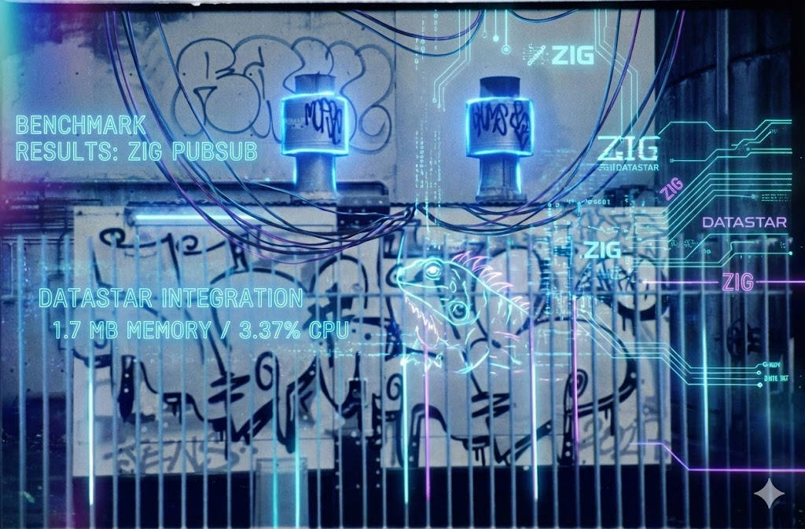

# Zig 0.16-dev Benchmark

To build - run `make`

Then run the benchmark

This benchmark is compatible with

https://github.com/zigster64/datastar.http.zig/tree/main/bench

... so it provides some numbers for comparison with the (more mature) datastar.http.zig SDK

Use `wrk -t12 -c400 -d10s http://localhost:8090/sse` to get some bench numbers

| Language | Test Case | Requests/sec | Latency (Avg) | Transfer/sec | Binary/RAM Size |
| :--- | :--- | :--- | :--- | :--- | :--- |
| **Zig** | Plain HTML | 39,654 | 5.50ms | **5.61 GB** | 533,672 |
| **Zig** | **Datastar SSE** 100k payload | **23,777** | **15.99ms** | 4.12 GB | 12.7 MB  |
| **Zig** | SSE % performance | |  | 73 % | |
| | | | | | |
| **Zig 0.16** | Plain HTML | 41,606 | 4.28ms | **5.89 GB** | 487,976 |
| **Zig 0.16** | **Datastar SSE** 100k payload | **28,275** | **11.50ms** | 4.90 GB | 21.5 MB  |
| **Zig 0.16** | SSE % performance | |  | 67  % | |
| | | | | | |
| **Zig 0.16 Fibers** | Plain HTML | 40,243 | 137.6us | **5.70 GB** | 665,896 |
| **Zig 0.16 Fibers** | **Datastar SSE** 100k payload | **26,996** | **237.5us** | 4.68 GB | 17.1 MB  |
| **Zig 0.16 Fibers** | SSE % performance | |  | 67  % | |
| | | | | | |
| **Rust** | Plain HTML | 38,201 | 5.13ms | **5.41 GB** | 1,845,936 |
| **Rust** | **Datastar SSE** 100k payload | **20,943** | **11.43ms** | 3.63 GB | 40.2 MB |
| **Rust** | SSE % performance | |  | 67 % | |
| | | | | | |
| **Go** | Plain HTML (no log)| 30,484 | 8.76ms | 4.32 GB | 7,995,922 |
| **Go** | Plain HTML | 23,730 | 11.89ms | 3.36 GB | 7,995,922 |
| **Go** | Datastar SSE 100k payload | 9,758 | 33.72ms | 1.69 GB | 43.8 MB |
| **Go** | SSE % performance | |  | 50 % | |
| | | | | | |
| **Bun** | Plain HTML (no Log) | 28,667 | 8.30ms | 4.06 GB | n/a |
| **Bun** | Plain HTML | 12,664 | 18.81ms | 1.79 GB | n/a |
| **Bun** | Datastar SSE (100k w/ Log) | 3,733 | 63.7ms | 662.85 MB | 32.3 MB |
| **Bun** | SSE % performance | |  | 36 % | |

# Why is SSE slower than straight HTML ?

Combination of things

- The SSE version has some CPU and Memory Allocation overhead to split up 100k of HTML into SSE event stream format, and apply chunked encoding.
- The behaviour of HTTP/1.1 keepalives with text/event-stream + chunked encoding.

With text/event-stream - when a browser sees a response of this type, with chunked encoding, it will consider that the current Tcp/IP connection 
is in use, so will route further requests through a new connection. With straight text/html + known content-length, browsers will exploit the 
HTTP/1.1 keepalive protocol to stream additional requests onto the existing network connection. So there is definitely some extra network overhead there. 
Exactly how much, I dont know.

I dont know if `wrk` conforms to that, or not either.

Would have to do some serious instrumenting to find out where the time is spent, but its probably a combination of all of the above.

The fact that its consistent across the board will different languages and SDKs suggests the numbers are pretty correct though.

Will revisit this with non-trivial benchmarking after Zig 0.16.0 is out, and preferably when Io.Evented is fully ironed out.
